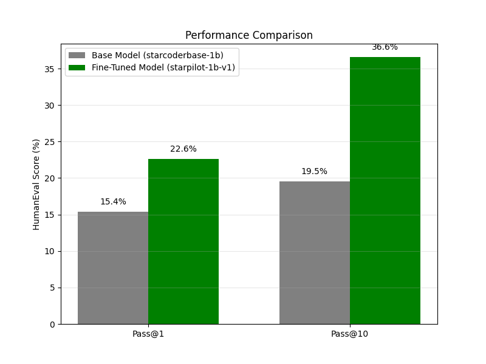

# StarPilot-1B: Your Personal Python Copilot

**StarPilot-1B** is a specialized coding assistant **fine-tuned** from [StarCoderBase-1B](https://huggingface.co/bigcode/starcoderbase-1b). It is designed to mimic the behavior of GitHub Copilot: specifically trained to interpret Python comments as instructions and auto-complete the corresponding code solution.

By leveraging **QLoRA** (Quantized Low-Rank Adaptation), a general code model was transformed into a highly specific Python specialist, achieving significant gains in the **HumanEval** benchmark while running efficiently on consumer hardware.

---

## 📊 Performance & Evaluation

StarPilot-1B was evaluated using the **BigCode Evaluation Harness** on the **HumanEval** dataset (164 Python programming problems). The model was tested in a sandboxed environment to verify code correctness.

### The "StarPilot" Boost

| Metric | Base-Model (StarCoder-1B) | **Fine-Tuned (StarPilot-1B)** | **Improvement** |
| --- | --- | --- | --- |
| **Pass@1** | *15.4* | *22.6* | **+7.2%** |
| **Pass@10** | *19.5* | *36.5* | **+17%**  |

> **Analysis:**
> * **Pass@1:** The fine-tuned model solves **7.2%** more problems on the very first attempt compared to the base model.
> * **Pass@10:** When allowed 10 attempts, the model's success rate jumps by over **17%**, solving nearly **37%** of all problems

### Visualization

Below is the comparative analysis generated from the evaluation pipeline:



---

## 🛠️ Methodology

### 1. Base Model & Dataset

* **Base Model:** [bigcode/starcoderbase-1b](https://huggingface.co/bigcode/starcoderbase-1b) (1 Billion parameters).
* **Dataset:** [Magicoder-Evol-Instruct-110K](https://huggingface.co/datasets/ise-uiuc/Magicoder-Evol-Instruct-110K).
* **Filtering:** The dataset was filtered specifically for Python code samples.
* **Reformatting:** Converted standard "Instruction/Response" pairs into a **Comment-to-Code** format (e.g., `# Instruction \n # Solution: \n Code`) to align with IDE autocomplete behaviors.


### 2. Fine-Tuning Technique: QLoRA

To train this model on a single **A100 GPU** with high efficiency, **QLoRA** (Quantized Low-Rank Adaptation) was utilized:

* **Quantization:** The base model was loaded in **4-bit precision (NF4)**, reducing memory usage by ~4x compared to FP16.
* **LoRA Adapters:** Instead of retraining all 1B parameters, the base weights were frozen and small, trainable rank decomposition matrices were attached to the linear layers.
* **Result:** Only **1.91%** of parameters (approx 22M) were trainable, allowing for faster convergence without catastrophic forgetting.

### 3. The "Copilot" Masking Strategy

A critical component of this project was the implementation of a Custom Data Collator (`CompletionCollator`). 

In standard Causal Language Modeling, the model calculates loss on every token. For this task, the goal is for the model to learn to generate code exclusively, not the accompanying comments.

So, a masking strategy was implemented that:
1.  Identifies the separator between the Comment (or Instruction) and the Code.
2.  Sets the label for the Comment tokens to `-100` (ignored by PyTorch CrossEntropyLoss).
3.  Calculates gradients **only** on the generated Python code.
---

## ⚙️ Training Configuration

The model was fine-tuned on a single **NVIDIA A100** using the Hugging Face `trl` library. Thanks to 4-bit quantization, the model weights consumed **less than 2GB of VRAM**, leaving ample room for large batch sizes.

### Hyperparameters
Hyperparameter configuration is as follows - 

#### LoRA Adapters
| Parameter | Value | Notes on Choice |
| :--- | :--- | :--- |
| **Rank (r)** | 32 | High rank for better model expressivity. |
| **Alpha** | 64 | Scaled to 2x rank for sufficient update influence. |
| **Dropout** | 0.05 | Prevents overfitting. |
| **Target Modules** | `all-linear` | Adapting all linear layers (not just attention) for better performance |

#### Training & Optimization
| Parameter | Value | Notes on Choice |
| :--- | :--- | :--- |
| **Max Steps** | 4000 | Ensures convergence on ~44k samples. |
| **Learning Rate** | 2e-4 |  LR required for effective QLoRA updates. |
| **Batch Size** | 8 | Sufficient to fit within GPU memory limits while using Gradient Accumulation. |
| **Grad Accumulation** | 4 | Simulates batch size of 32 for stability. |
| **Optimizer** | `paged_adamw_32bit` | Pages optimizer states to CPU RAM preventing OOM crashes. |
| **Scheduler** | Cosine | For smooth decay. |
| **Patience** | 3 | Early stopping trigger. |

#### Data & Hardware
| Parameter | Value | Notes on Choice |
| :--- | :--- | :--- |
| **Max Seq Length** | 2048 | Sufficient context window to capture full function definitions and comments. |
| **Precision** | `bf16` | Uses native A100 support for speed/stability. |
| **Grad Checkpointing** | `True` | Trades compute speed for significant VRAM savings. |

---

## 🚀 How to Use StarPilot-1B

Follow these steps to set up the environment and prepare the model for inference.

### 1. Setup
Clone the repository and install the required libraries:
```bash
# Clone the repository
git clone https://github.com/sahilX7/StarPilot-1B.git

# Move into the project directory
cd StarPilot-1B

# Install dependencies
pip install -q transformers accelerate bitsandbytes datasets peft
```

### 2. Python Inference Code
Create a Python script (e.g., `run_pilot.py`) in the root directory and use the following code. Note that adapter_id points to the local `./starpilot-1b-v1` folder.
```python
import torch
from transformers import AutoTokenizer, AutoModelForCausalLM
from peft import PeftModel

# 1. Configuration
base_model_id = "bigcode/starcoderbase-1b"
adapter_id = "starpilot-1b-v1" 

# 2. Load Base Model
model = AutoModelForCausalLM.from_pretrained(
    base_model_id,
    torch_dtype=torch.float16,
    device_map="auto"
)

# 3. Attach StarPilot Adapters
model = PeftModel.from_pretrained(model, adapter_id)

# 4. Run Inference
tokenizer = AutoTokenizer.from_pretrained(base_model_id, trust_remote_code=True)

# Format prompt
prompt = "# Write a Python function to reverse a string\n# Solution:\n"
inputs = tokenizer(prompt, return_tensors="pt").to("cuda")

print("\nGenerating code...")
outputs = model.generate(**inputs, max_new_tokens=100, temperature=0.2)
print("-" * 40)
print(tokenizer.decode(outputs[0], skip_special_tokens=True))
print("-" * 40)

```

---

## 📦 Project Structure

```
StarPilot-1B/
├── evaluation-results/          # Artifacts generated during the evaluation pipeline
│   ├── generations/             # JSON files containing raw code samples from models
│   ├── metrics/                 # JSON files with calculated Pass@1 and Pass@10 scores
│   └── comparison.png           # Visual bar chart comparing Base vs. Fine-Tuned model
├── starpilot-1b-v1/             # The saved LoRA adapter weights (PEFT module)
├── .gitignore                   # Specifies untracked files
├── evaluation.ipynb             # Evaluation Pipeline
├── fine-tuning.ipynb            # Fine-Tuning Pipeline
└── README.md                    # Project documentation
```

## 📜 License

This model is a fine-tune of StarCoderBase and is subject to the **[BigCode OpenRAIL-M](https://huggingface.co/spaces/bigcode/bigcode-model-license-agreement)** license agreement.
